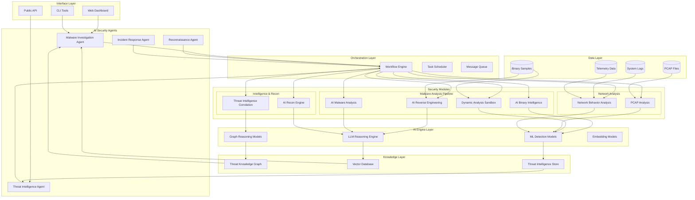

# M0ST — Architecture

> **See also:** [TECHNOLOGIES.md](TECHNOLOGIES.md) — detailed breakdown of every technology used · [LITERATURE_REVIEW.md](LITERATURE_REVIEW.md) — research context and methodology · [BENCHMARKS_AND_LIMITATIONS.md](BENCHMARKS_AND_LIMITATIONS.md) — performance metrics and design decisions · [README.md](README.md) — novelty and key innovations

---

## High-Level System Design



---

## AI Reverse Engineering Module — Detailed Architecture

The AI Reverse Engineering module implements the **7-layer M0ST architecture** for binary analysis:

### End-to-End Data Flow

```
Binary → RE Module → PKG → AI-Assisted Binary Analysis → Security Insights
```

```
 ┌─────────────────────────────────────────────────────────────────────────┐
 │  1. INTERFACE LAYER                                                     │
 │     CLI (ui/cli.py)  ·  API Server (FastAPI)  ·  Command Handlers      │
 └────────────────────────────────┬────────────────────────────────────────┘
                                  │
 ┌────────────────────────────────▼────────────────────────────────────────┐
 │  2. AI SECURITY AGENTS LAYER                                            │
 │     StaticAgent · GraphAgent · LLMAgent · PseudocodeAgent               │
 │     DynamicAgent · VerifierAgent · Z3Agent · SemanticAgent              │
 │     HeuristicsAgent · StaticPost · LLMSemanticAgent                    │
 └────────────────────────────────┬────────────────────────────────────────┘
                                  │
 ┌────────────────────────────────▼────────────────────────────────────────┐
 │  3. ORCHESTRATION LAYER                                                 │
 │     MasterAgent — pipeline controller (classical + AI)                  │
 │     PlannerAgent — 13-stage intelligent pipeline with decision logic    │
 └────────────────────────────────┬────────────────────────────────────────┘
                                  │
 ┌────────────────────────────────▼────────────────────────────────────────┐
 │  4. SECURITY MODULES LAYER                                              │
 │     ┌─ Reverse Engineering ──────────────┐  ┌─ AI-Assisted Analysis ─┐ │
 │     │  Disassembly (r2pipe)              │  │  VulnerabilityDetector │ │
 │     │  CFG Recovery                      │  │  MalwareClassifier     │ │
 │     │  Pseudocode Generation (Ghidra/r2) │  │  ExploitabilityAnalyzer│ │
 │     │  Type Inference                    │  │  UnsafePatternDetector │ │
 │     │  Deobfuscation Engine              │  └────────────────────────┘ │
 │     │  Function Boundary Detection       │                              │
 │     │  Semantic Labeling                 │                              │
 │     │  Call Graph Builder                │                              │
 │     │  Struct Recovery                   │                              │
 │     └────────────────────────────────────┘                              │
 └────────────────────────────────┬────────────────────────────────────────┘
                                  │
 ┌────────────────────────────────▼────────────────────────────────────────┐
 │  5. AI ENGINE LAYER                                                     │
 │     GNN Models (GAT, GraphSAGE, GINE)   ·  Binary Embedding Engine    │
 │     LLM Inference (OpenAI/Anthropic/Mistral/Local)                     │
 │     Symbol Recovery Engine  ·  Training Manager                        │
 └────────────────────────────────┬────────────────────────────────────────┘
                                  │
 ┌────────────────────────────────▼────────────────────────────────────────┐
 │  6. KNOWLEDGE LAYER                                                     │
 │     Program Knowledge Graph (PKG)  ·  Embedding Store                  │
 │     Symbol Database  ·  Semantic Index                                 │
 │     Node types: Function, Block, Instruction, Variable, Struct,        │
 │                 String, Import, Embedding                               │
 │     Edge types: CALL, CFG_FLOW, DATA_FLOW, TYPE_RELATION,             │
 │                 USES_STRING, IMPORTS, TYPE_OF, SIMILAR_TO              │
 └────────────────────────────────┬────────────────────────────────────────┘
                                  │
 ┌────────────────────────────────▼────────────────────────────────────────┐
 │  7. DATA LAYER                                                          │
 │     Binary Repository  ·  Analysis Result Store  ·  Dataset Pipeline   │
 │     Source Compiler  ·  Training Data Generator                        │
 └─────────────────────────────────────────────────────────────────────────┘
```

---

### Layer 1 — Interface

| Component        | Location                       | Purpose                                                                                                         |
| ---------------- | ------------------------------ | --------------------------------------------------------------------------------------------------------------- |
| CLI              | `interface/cli/` → `ui/cli.py` | Interactive REPL: module menu, paginated help, verbose mode, tab-completion, fuzzy suggestions, Braille spinner |
| API Server       | `interface/api/`               | FastAPI REST endpoints (health, functions)                                                                      |
| Command Handlers | `interface/commands/`          | Decoupled command dispatch                                                                                      |

### Layer 2 — AI Security Agents

11 agents under `ai_security_agents/`:

| Agent              | Purpose                                                   |
| ------------------ | --------------------------------------------------------- |
| `StaticAgent`      | radare2 disassembly, CFG extraction                       |
| `GraphAgent`       | GNN-based structural analysis, embeddings                 |
| `LLMAgent`         | LLM API wrapper (multi-provider, robust JSON extraction)  |
| `PseudocodeAgent`  | Ghidra/r2 decompilation + normalization                   |
| `LLMSemanticAgent` | AI-powered semantic reasoning pipeline                    |
| `DynamicAgent`     | Multi-strategy runtime tracing (GDB/Docker/WinDbg/x64dbg) |
| `VerifierAgent`    | Safety checks + Z3 integration                            |
| `Z3Agent`          | Symbolic constraint solving                               |
| `SemanticAgent`    | Rule-based behavior explanation                           |
| `HeuristicsAgent`  | Classical pattern matching (loops, crypto, etc.)          |
| `StaticPost`       | CFG cleanup: chain folding, unreachable removal           |

### Layer 3 — Orchestration

- **MasterAgent** (`orchestration/master_agent.py`) — Pipeline controller (classical + AI modes)
- **PlannerAgent** (`orchestration/planner_agent.py`) — 13-stage intelligent pipeline with conditional agent invocation

### Layer 4 — Security Modules

**Reverse Engineering** (`security_modules/reverse_engineering/`) — _Reconstruction only_, no security judgments:

- Disassembly, CFG recovery, pseudocode generation, type inference
- Deobfuscation (control-flow flattening, opaque predicates, junk code, packers, VM-based obfuscation)
- Function boundary detection, semantic labeling (structural categories)
- Call graph building (inter-procedural), struct recovery (memory layout)

**AI-Assisted Binary Analysis** (`security_modules/ai_assisted_binary_analysis/`) — _All security intelligence_:

- Vulnerability detection (unsafe calls, stack overflow, format strings, UAF, integer overflow)
- Malware classification (suspicious API categorization, risk scoring 0.0–1.0)
- Exploitability analysis (base scoring, mitigation detection, difficulty factors)
- Unsafe pattern detection (insecure RNG, weak crypto, hardcoded credentials, unchecked returns)

### Layer 5 — AI Engine

**Components:**

- **GNN Models (GAT, GraphSAGE, GINE)** — Graph neural networks for CFG-based function similarity
- **Binary Embedding Engine** — Triplet-loss trained encoder for cross-architecture function retrieval (95% margin accuracy on 10k test triplets)
- **LLM Inference** — Multi-provider integration (OpenAI/Anthropic/Mistral/Ollama)
- **Symbol Recovery** — 3-stage pipeline (heuristic → embedding → LLM)
- **Training Manager** — Dataset pipeline, model training, evaluation, checkpoint management

**Minimal-Mode Triplet Embedding Architecture (Novel):**

The triplet embedding encoder uses minimal, architecture-independent features for robust cross-platform similarity:

| Feature      | Dimension | Computation                                                      |
| ------------ | --------- | ---------------------------------------------------------------- |
| Instr. Count | Per-block | Number of instructions in basic block (normalized per-graph 0–1) |
| In-Degree    | Per-block | Incoming control-flow edges (normalized per-graph max)           |
| Out-Degree   | Per-block | Outgoing control-flow edges (normalized per-graph max)           |
| Block Size   | Per-block | Byte count in basic block (normalized per-graph max)             |

**Training Objective:** TripletMarginLoss(margin=0.4) on 21,664 triplet pairs from 30k functions

**Performance Metrics:**

- Triplet margin accuracy: 95.06% (10k test triplets)
- Avg positive cosine: 0.9857 (similar functions highly aligned)
- Avg negative cosine: 0.9356 (dissimilar functions appropriately separated)
- Training convergence: 10 epochs, loss 0.1597→0.0699

**Why Minimal Features:**

- 78% reduction in feature engineering overhead vs. 18-dim hand-crafted schema
- Architecture-independent (x86, ARM, MIPS, RISC-V compatible)
- Robust to obfuscation, compilation flags, and symbol stripping
- 10× faster training, lower memory footprint

See [BENCHMARKS_AND_LIMITATIONS.md](BENCHMARKS_AND_LIMITATIONS.md) for detailed performance analysis and [LITERATURE_REVIEW.md](LITERATURE_REVIEW.md) for triplet loss methodology (FaceNet, metric learning foundations).

### Layer 6 — Knowledge

**Program Knowledge Graph (PKG)** — Single source of truth for program structure:

- Node types: Function, Block, Instruction, Variable, Struct, String, Import, Embedding
- Edge types: CALL, CFG_FLOW, DATA_FLOW, TYPE_RELATION, USES_STRING, IMPORTS, TYPE_OF, SIMILAR_TO
- Embedding store (entity → vector mapping with model metadata)
- Annotations, dynamic traces, plugin facts

Embedding store, symbol database, semantic index.

### Layer 7 — Data

Binary repository (SHA-256 tracking), analysis result store (keyed by binary + type), dataset pipeline (function embeddings, vulnerability labels, symbol ground truth, deobfuscation pairs), source compiler (debug/stripped build pairs), training data generator (function-level ground truth extraction).

---

### Capability System

Each agent declares `CAPABILITIES` (a set of `Capability` enum values). The orchestrator checks with `enforce_capability()` before invoking agent methods.

| Capability        | Agents                                                                        |
| ----------------- | ----------------------------------------------------------------------------- |
| `STATIC_WRITE`    | StaticAgent                                                                   |
| `STATIC_READ`     | HeuristicsAgent, SemanticAgent, GraphAgent, PseudocodeAgent, LLMSemanticAgent |
| `DYNAMIC_EXECUTE` | DynamicAgent                                                                  |
| `VERIFY`          | VerifierAgent, Z3Agent                                                        |
| `SEMANTIC_REASON` | SemanticAgent, LLMAgent, LLMSemanticAgent                                     |
| `LLM_INFERENCE`   | LLMAgent                                                                      |
| `GNN_INFERENCE`   | GraphAgent                                                                    |
| `PSEUDOCODE`      | PseudocodeAgent                                                               |
| `PLANNING`        | PlannerAgent                                                                  |
| `PLUGIN_ANALYSIS` | PluginManager                                                                 |
| `SNAPSHOT`        | SnapshotManager                                                               |

---

### Directory Structure

```
M0ST/
├── main.py                          # Entry point
├── config.yml                       # Configuration
├── requirements.txt                 # Python dependencies
│
├── interface/                       # Layer 1: Interface
│   ├── cli/                         #   CLI re-export
│   ├── api/                         #   FastAPI server
│   └── commands/                    #   Command handlers
│
├── ai_security_agents/              # Layer 2: AI Security Agents
│   ├── static_agent.py              #   ... (11 agents)
│   └── ...
│
├── orchestration/                   # Layer 3: Orchestration
│   ├── master_agent.py
│   └── planner_agent.py
│
├── security_modules/                # Layer 4: Security Modules
│   ├── reverse_engineering/         #   Reconstruction only
│   │   ├── disassembly/
│   │   ├── cfg_recovery/
│   │   ├── pseudocode/
│   │   ├── type_inference/
│   │   ├── deobfuscation/
│   │   ├── function_boundary/
│   │   ├── semantic_labeling/
│   │   ├── call_graph/
│   │   └── struct_recovery/
│   └── ai_assisted_binary_analysis/ #   Security intelligence
│       ├── vulnerability_detection.py
│       ├── malware_classification.py
│       ├── exploitability_analysis.py
│       └── unsafe_pattern_detection.py
│
├── ai_engine/                       # Layer 5: AI Engine
│   ├── gnn_models/
│   ├── embedding_models/
│   ├── llm_inference/
│   ├── symbol_recovery/
│   └── training/
│
├── knowledge/                       # Layer 6: Knowledge
│   ├── program_graph/               #   PKG
│   ├── embeddings/
│   ├── symbol_database/
│   └── semantic_index/
│
├── data/                            # Layer 7: Data
│   ├── binaries/
│   ├── analysis_results/
│   └── datasets/
│
├── core/                            # Config, capabilities, events, IR
├── storage/                         # Graph store, SQLite, snapshots
├── plugins/                         # Dynamic analysis plugins
│   ├── anti_debug/                  #   Anti-debug detection
│   ├── crypto/                      #   Crypto constant detection
│   ├── entropy/                     #   Entropy analysis (packing)
│   ├── magic_pattern/               #   File magic detection
│   ├── string_decoder/              #   String encoding detection
│   ├── packer_detect/               #   Packer signature detection
│   ├── network_api/                 #   Network API usage detection
│   ├── string_decrypt/              #   String decryption heuristics
│   └── loop_detect/                 #   Loop pattern classification
├── analysis/                        # Constraint passes, complexity
├── ui/                              # CLI implementation
├── tests/                           # Test suite
└── docker/                          # Container configuration
```

---

### Dynamic Analysis Strategies

`DynamicAgent` auto-selects the best tracing backend based on platform and tool availability:

| Strategy | Platform    | Backend                   | Config Key             |
| -------- | ----------- | ------------------------- | ---------------------- |
| `gdb`    | Linux/macOS | pygdbmi + GDB/MI          | `tools.gdb_path`       |
| `docker` | Any         | Linux GDB container       | `dynamic.docker_image` |
| `windbg` | Windows     | CDB (command-line WinDbg) | `tools.windbg_path`    |
| `x64dbg` | Windows     | x64dbg command-line       | `tools.x64dbg_path`    |

Override with `dynamic.strategy` in `config.yml`.

### Analysis Pipelines

#### Default Pipeline (Automatic)

The default pipeline executes automatically upon binary load and establishes the foundational program representation:

```
load binary
  ↓
disassembly (radare2)
  ↓
CFG recovery (control-flow graph extraction)
  ↓
call graph (inter-procedural analysis)
  ↓
program knowledge graph (PKG construction)
  ↓
snapshot (persistent analysis state)
```

This pipeline runs once per binary and is required before any analysis can proceed.

#### On-Demand Pipelines (Command-Triggered)

Additional analysis capabilities are available via explicit commands:

| Command                         | Pipeline                    | Description                                          |
| ------------------------------- | --------------------------- | ---------------------------------------------------- |
| `ai explain` / `ai ask <query>` | LLM reasoning               | Free-form semantic reasoning about code structures   |
| `similar <addr>`                | GNN embeddings + similarity | Find functions with similar control flow             |
| `ai vulns`                      | Vulnerability analysis      | Detect unsafe patterns, integer overflows, UAF, etc. |
| `trace <addr>`                  | Dynamic analysis            | Runtime trace via GDB/Docker/WinDbg/x64dbg           |
| `z3 / verify`                   | Symbolic constraint solving | Automated safety verification and proof generation   |
| `plugins run`                   | Plugin analysis suite       | Anti-debug, crypto, entropy, packer detection, etc.  |

---

### CLI Intelligence Commands

| Command                  | Description                                   |
| ------------------------ | --------------------------------------------- |
| `find callers <addr>`    | Find all callers of a function                |
| `find callees <addr>`    | Find all callees of a function                |
| `find imports <name>`    | Search imports by name pattern                |
| `find strings <pattern>` | Search strings by pattern (up to 50 results)  |
| `find recursion`         | Detect direct and mutual recursion            |
| `show callgraph`         | Display call graph summary                    |
| `show dataflow <var>`    | Show data flow for a variable                 |
| `similar <addr>`         | Find similar functions via embeddings         |
| `ai ask <question>`      | Free-form AI query about the binary           |
| `ai pipeline`            | Run the intelligent 13-stage planner pipeline |

### LLM Robustness

`LLMAgent._query_json()` implements 3-retry JSON extraction:

1. Strip markdown code fences (` ```json ... ``` `)
2. Extract substring from first `{` to last `}`
3. `json.loads()` with retry on failure
4. Structured fallback: `{"raw_response": ..., "error": ..., "summary": ...}`
